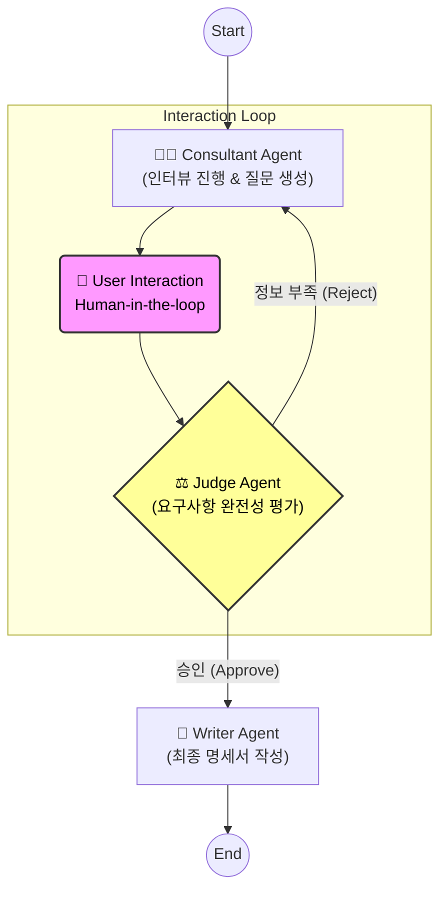

# ✈️ SpecPilot: Cloud-Native SRS Automation Agent

## 1. 프로젝트 개요 (Project Overview)
> **"From Vague Ideas to Concrete Specs."**
> **SpecPilot**은 모호한 아이디어를 명확한 기술 명세서로 전환하는 **AI 기반의 요구사항 항해사(Navigator)**입니다.

SI 및 엔터프라이즈 프로젝트 초기 단계에서 기획자와 개발자 간의 간극을 줄이고, **LangGraph 기반의 자율 검증 루프(Loop)**를 통해 개발 가능한 수준(Dev-Ready)의 **요구사항 명세서(SRS)**를 자동 생성합니다.

---

## 2. 개발 배경 (Why SpecPilot?)
### ☁️ AtDev & Enterprise 환경의 Pain Point
* **불명확한 항로 (Unclear Requirements):** 고객의 요구사항은 구체적이지 않아 프로젝트 초기에 잦은 방향 수정(Rework)이 발생합니다.
* **복잡한 기술 환경 (Tech Complexity):** 단순 기능 구현을 넘어, MSA/Cloud 등 앳데브(AtDev)의 주력 기술 스택에 맞는 설계가 필요합니다.

### 💡 SpecPilot의 해결책
단순한 챗봇이 아닙니다. **SpecPilot**은 전문 컨설턴트처럼 **'질문(Ask)'**하고, PM처럼 **'검증(Judge)'**하며, 아키텍트처럼 **'제안(Suggest)'**하여 프로젝트의 첫 단추를 완벽하게 끼워줍니다.

---

## 3. 시스템 아키텍처 (System Architecture)
SpecPilot은 **LangGraph**를 활용한 **Stateful Multi-Agent System**으로 구축되었습니다. 3단계의 체계적인 파이프라인을 통해 환각(Hallucination)을 방지하고 문서의 품질을 보장합니다.

### 🧩 Agent Workflow (LangGraph)

---

## 4. SpecPilot만의 차별화 전략 (Key Features)

### ① AI 주도형 요구사항 정의 인터랙션 (Auto-BA Interview Loop)
* **상황 (Problem):** 사용자가 "쇼핑몰을 만들고 싶어요"와 같이 추상적인 요청을 입력하는 경우, 기존에는 개발자가 다시 연락해서 물어봐야 했습니다.
* **해결 (Solution):** SpecPilot은 전문 **Business Analyst(BA)**처럼 핵심 질문을 스스로 생성하여 되묻습니다.
    * *예시: "결제 수단은 카드/가상계좌 중 무엇을 지원하나요?", "예상되는 상품 SKU 수는 얼마나 되나요?"*
* **메커니즘 (Tech):** LangGraph의 `Interrupt` 기능을 활용하여, **"개발자가 바로 사용할 수 있는 수준의 SRS 입력값"**이 확보될 때까지 스마트한 반복 인터뷰(Loop)를 진행합니다.

### ② Judge 노드를 통한 품질 보증 (Quality Gate)
* LLM의 고질적인 문제인 '모르면서 아는 척하는' 환각 현상을 차단하기 위해, **별도의 평가자(Judge) 에이전트**를 두어 정보가 불충분할 경우 절대 다음 단계로 넘어가지 않도록 설계했습니다.

### ③ Cloud-Native 기술 스택 추천 (Tech Alignment)
* **앳데브의 기술적 강점**을 반영하여, 기능 정의 시 **MSA, AWS Lambda, Docker, Kubernetes, Kafka** 등 현대적인 아키텍처 구현을 위한 기술 스택을 '비고' 란에 자동 추천합니다.

### ④ TDD를 위한 Gherkin 시나리오 생성
* 개발 생산성을 높이기 위해, 주요 기능별로 **Given-When-Then** 형식의 테스트 케이스를 함께 출력하여 **개발자가 즉시 테스트 코드를 작성할 수 있도록 지원**합니다.

---

## 5. 기술 스택 (Tech Stack)
* **Orchestration:** LangGraph, LangChain
* **LLM:** OpenAI GPT-4o (Reasoning & Generation)
* **Backend:** Python 3.10+
* **Frontend:** Streamlit (Chat Interface)
* **Validation:** Pydantic (Output Parsing)

---

## 6. 기대 효과 (Expected Impact)
1.  **커뮤니케이션 비용 60% 절감:** 기획 단계의 불필요한 미팅과 이메일 핑퐁을 AI 인터뷰로 대체하여 시간을 단축합니다.
2.  **표준화된 산출물:** 개발자 개인의 문서 작성 역량에 의존하지 않고, 모든 프로젝트에 동일한 포맷과 고품질의 기획서를 제공합니다.
3.  **DevOps 가속화:** 기획 단계에서 기술 스택과 테스트 코드를 미리 제안함으로써 CI/CD 및 품질 보증 단계와 즉시 연계가 가능합니다.

---

## 7. 향후 로드맵 (Roadmap)
* **v2.0 (RAG):** 사내 레거시 시스템 문서나 API 문서를 학습(Embedding)하여, 기존 시스템과 호환되는 명세서 작성 기능 추가.
* **v3.0 (Integration):** 생성된 명세서를 Jira/Confluence에 원클릭으로 업로드하는 기능 연동.