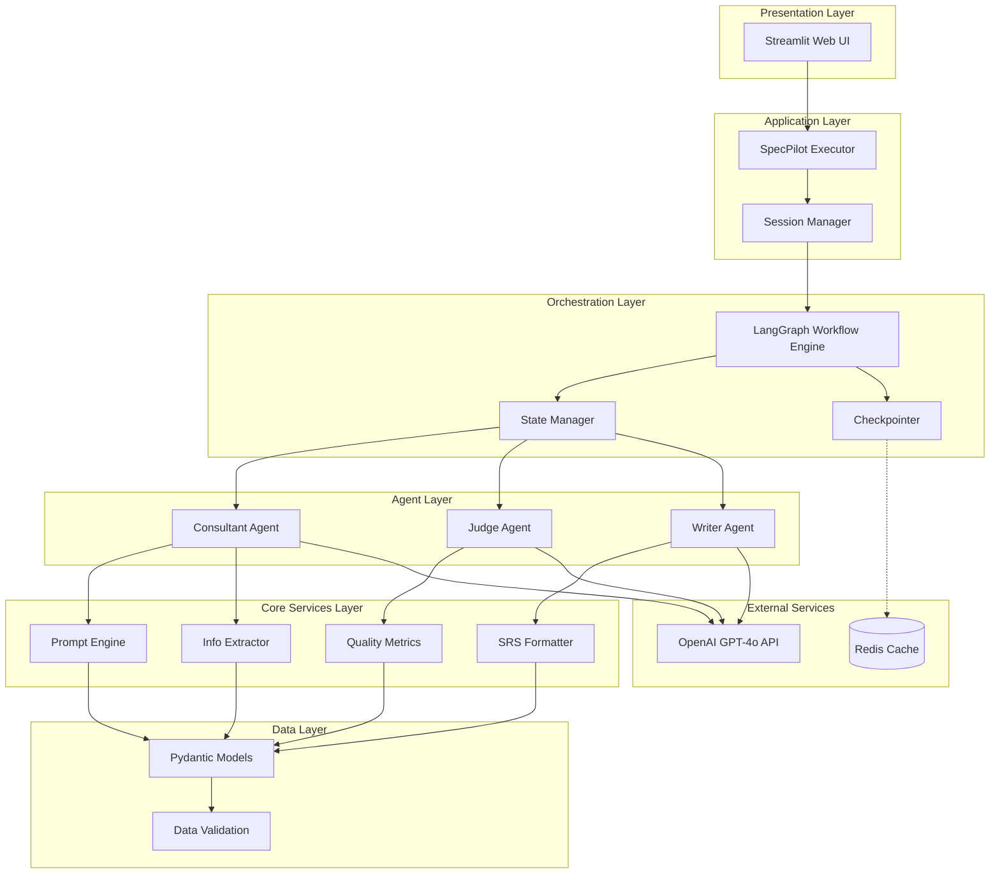
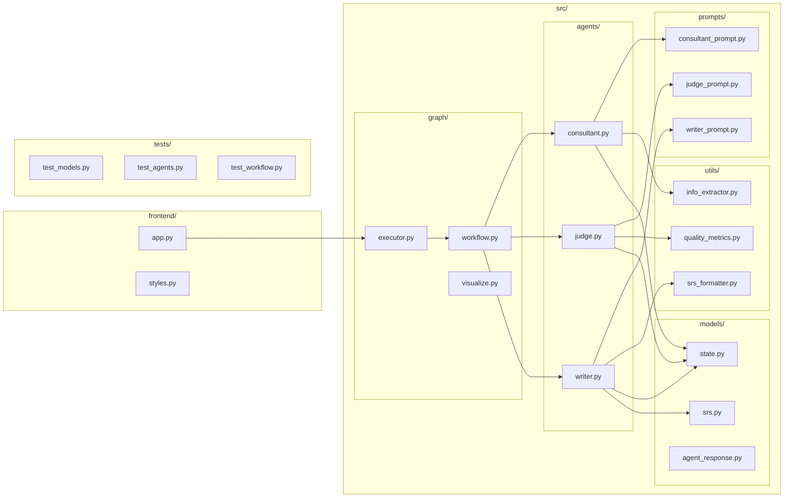
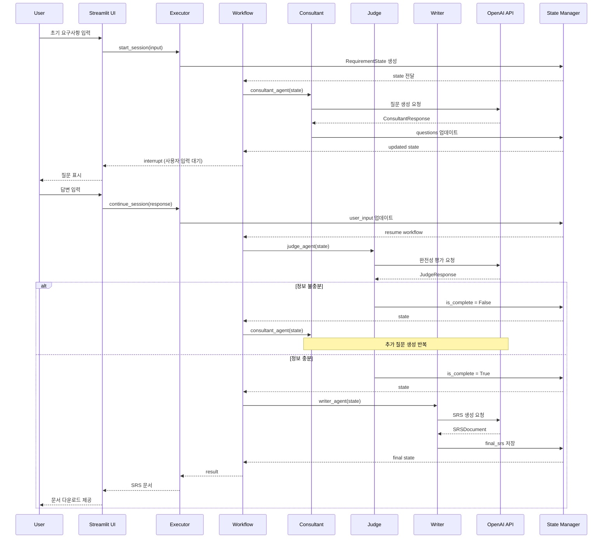
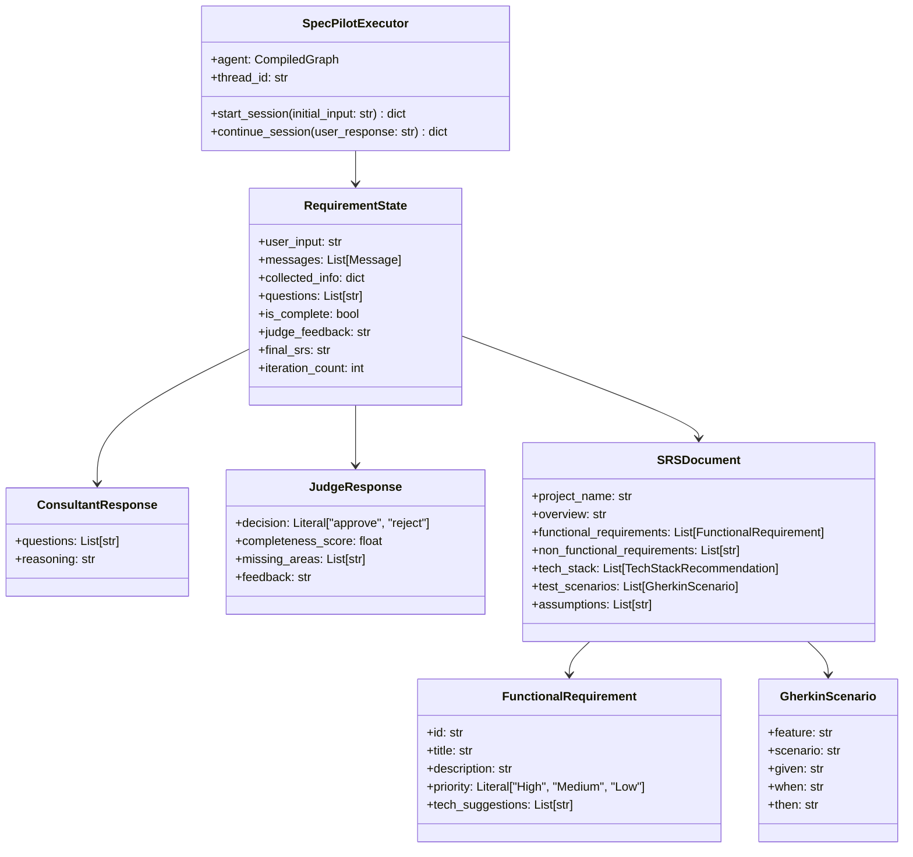
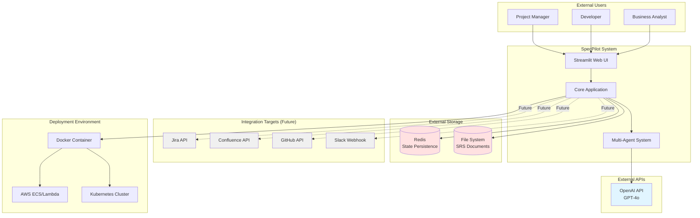

# SpecPilot 시스템 아키텍처

## 아키텍처 구성요소

### 1. 계층 구조

```mermaid
graph TB
    subgraph "Presentation Layer"
        UI[Streamlit Web UI]
    end

    subgraph "Application Layer"
        Executor[SpecPilot Executor]
        SessionManager[Session Manager]
    end

    subgraph "Orchestration Layer"
        LangGraph[LangGraph Workflow Engine]
        StateManager[State Manager]
        Checkpointer[Checkpointer]
    end

    subgraph "Agent Layer"
        Consultant[Consultant Agent]
        Judge[Judge Agent]
        Writer[Writer Agent]
    end

    subgraph "Core Services Layer"
        PromptEngine[Prompt Engine]
        InfoExtractor[Info Extractor]
        SRSFormatter[SRS Formatter]
        QualityMetrics[Quality Metrics]
    end

    subgraph "Data Layer"
        Models[Pydantic Models]
        Validation[Data Validation]
    end

    subgraph "External Services"
        OpenAI[OpenAI GPT-4o API]
        Redis[(Redis Cache)]
    end

    UI --> Executor
    Executor --> SessionManager
    SessionManager --> LangGraph
    LangGraph --> StateManager
    LangGraph --> Checkpointer
    StateManager --> Consultant
    StateManager --> Judge
    StateManager --> Writer
    Consultant --> PromptEngine
    Consultant --> InfoExtractor
    Judge --> QualityMetrics
    Writer --> SRSFormatter
    Consultant --> OpenAI
    Judge --> OpenAI
    Writer --> OpenAI
    Checkpointer -.-> Redis
    Models --> Validation
    PromptEngine --> Models
    InfoExtractor --> Models
    SRSFormatter --> Models
    QualityMetrics --> Models
```

### 2. 모듈화 및 컴포넌트

```mermaid
graph LR
    subgraph "src/"
        subgraph "agents/"
            A1[consultant.py]
            A2[judge.py]
            A3[writer.py]
        end

        subgraph "graph/"
            G1[workflow.py]
            G2[executor.py]
            G3[visualize.py]
        end

        subgraph "models/"
            M1[state.py]
            M2[srs.py]
            M3[agent_response.py]
        end

        subgraph "prompts/"
            P1[consultant_prompt.py]
            P2[judge_prompt.py]
            P3[writer_prompt.py]
        end

        subgraph "utils/"
            U1[info_extractor.py]
            U2[srs_formatter.py]
            U3[quality_metrics.py]
        end
    end

    subgraph "frontend/"
        F1[app.py]
        F2[styles.py]
    end

    subgraph "tests/"
        T1[test_models.py]
        T2[test_agents.py]
        T3[test_workflow.py]
    end

    G1 --> A1
    G1 --> A2
    G1 --> A3
    A1 --> P1
    A2 --> P2
    A3 --> P3
    A1 --> U1
    A2 --> U3
    A3 --> U2
    A1 --> M1
    A2 --> M1
    A3 --> M1
    A3 --> M2
    F1 --> G2
    G2 --> G1
```

### 3. 데이터 흐름

```mermaid
sequenceDiagram
    participant User
    participant UI as Streamlit UI
    participant Exec as Executor
    participant WF as Workflow
    participant C as Consultant
    participant J as Judge
    participant W as Writer
    participant LLM as OpenAI API
    participant State as State Manager

    User->>UI: 초기 요구사항 입력
    UI->>Exec: start_session(input)
    Exec->>State: RequirementState 생성
    State-->>WF: state 전달
    WF->>C: consultant_agent(state)

    C->>LLM: 질문 생성 요청
    LLM-->>C: ConsultantResponse
    C->>State: questions 업데이트
    State-->>WF: updated state
    WF-->>UI: interrupt (사용자 입력 대기)

    UI-->>User: 질문 표시
    User->>UI: 답변 입력
    UI->>Exec: continue_session(response)
    Exec->>State: user_input 업데이트
    State-->>WF: resume workflow

    WF->>J: judge_agent(state)
    J->>LLM: 완전성 평가 요청
    LLM-->>J: JudgeResponse

    alt 정보 불충분
        J->>State: is_complete = False
        State-->>WF: state
        WF->>C: consultant_agent(state)
        Note over C,LLM: 추가 질문 생성 반복
    else 정보 충분
        J->>State: is_complete = True
        State-->>WF: state
        WF->>W: writer_agent(state)
        W->>LLM: SRS 생성 요청
        LLM-->>W: SRSDocument
        W->>State: final_srs 저장
        State-->>WF: final state
        WF-->>Exec: result
        Exec-->>UI: SRS 문서
        UI-->>User: 문서 다운로드 제공
    end
```

### 4. API 및 인터페이스

```mermaid
classDiagram
    class SpecPilotExecutor {
        +agent: CompiledGraph
        +thread_id: str
        +start_session(initial_input: str) dict
        +continue_session(user_response: str) dict
    }

    class RequirementState {
        +user_input: str
        +messages: List[Message]
        +collected_info: dict
        +questions: List[str]
        +is_complete: bool
        +judge_feedback: str
        +final_srs: str
        +iteration_count: int
    }

    class ConsultantResponse {
        +questions: List[str]
        +reasoning: str
    }

    class JudgeResponse {
        +decision: Literal["approve", "reject"]
        +completeness_score: float
        +missing_areas: List[str]
        +feedback: str
    }

    class SRSDocument {
        +project_name: str
        +overview: str
        +functional_requirements: List[FunctionalRequirement]
        +non_functional_requirements: List[str]
        +tech_stack: List[TechStackRecommendation]
        +test_scenarios: List[GherkinScenario]
        +assumptions: List[str]
    }

    class FunctionalRequirement {
        +id: str
        +title: str
        +description: str
        +priority: Literal["High", "Medium", "Low"]
        +tech_suggestions: List[str]
    }

    class GherkinScenario {
        +feature: str
        +scenario: str
        +given: str
        +when: str
        +then: str
    }

    SpecPilotExecutor --> RequirementState
    RequirementState --> ConsultantResponse
    RequirementState --> JudgeResponse
    RequirementState --> SRSDocument
    SRSDocument --> FunctionalRequirement
    SRSDocument --> GherkinScenario
```

### 5. 시스템 외부 환경과의 관계

```mermaid
graph TB
    subgraph "External Users"
        PM[Project Manager]
        Dev[Developer]
        BA[Business Analyst]
    end

    subgraph "SpecPilot System"
        UI[Streamlit Web UI]
        Core[Core Application]
        Agents[Multi-Agent System]
    end

    subgraph "External APIs"
        OpenAI[OpenAI API<br/>GPT-4o]
    end

    subgraph "External Storage"
        Redis[(Redis<br/>State Persistence)]
        FileSystem[(File System<br/>SRS Documents)]
    end

    subgraph "Integration Targets (Future)"
        Jira[Jira API]
        Confluence[Confluence API]
        GitHub[GitHub API]
        Slack[Slack Webhook]
    end

    subgraph "Deployment Environment"
        Docker[Docker Container]
        AWS[AWS ECS/Lambda]
        K8s[Kubernetes Cluster]
    end

    PM --> UI
    Dev --> UI
    BA --> UI

    UI --> Core
    Core --> Agents
    Agents --> OpenAI
    Core --> Redis
    Core --> FileSystem

    Core -.Future.-> Jira
    Core -.Future.-> Confluence
    Core -.Future.-> GitHub
    Core -.Future.-> Slack

    Core --> Docker
    Docker --> AWS
    Docker --> K8s

    style OpenAI fill:#e1f5ff
    style Redis fill:#ffe1e1
    style FileSystem fill:#ffe1e1
    style Jira fill:#f0f0f0
    style Confluence fill:#f0f0f0
    style GitHub fill:#f0f0f0
    style Slack fill:#f0f0f0
```
