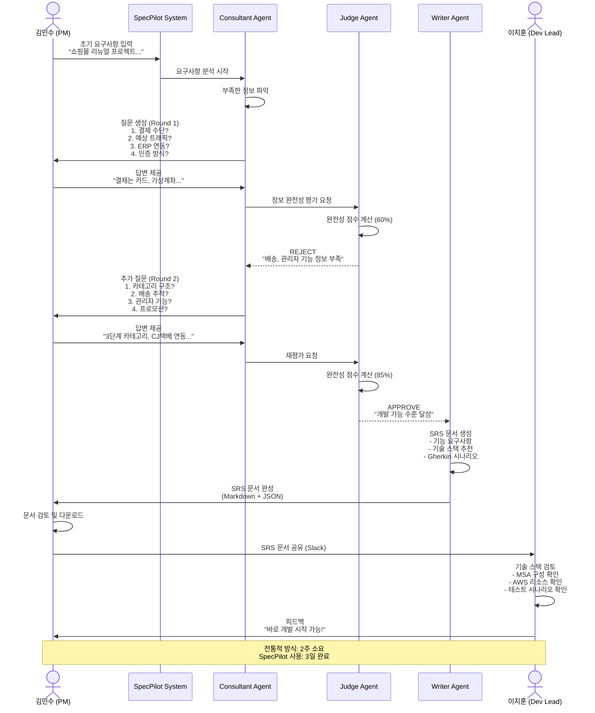

# SpecPilot 사용자 시나리오

## 페르소나 (Persona)

### 주인공: 김민수 (PM/기획자)
- **직책:** SI 프로젝트 매니저
- **경력:** 5년차
- **소속:** 중견 SI 기업 프로젝트팀
- **기술 수준:** 기술 이해도는 있으나 개발자 수준의 상세 명세 작성 경험 부족
- **주요 업무:** 고객 요구사항 수집, 프로젝트 기획서 작성, 개발팀과의 커뮤니케이션

### 부 페르소나: 이지훈 (개발팀 리드)
- **직책:** 백엔드 개발 리드
- **경력:** 8년차
- **기술 스택:** MSA, Kubernetes, AWS
- **Pain Point:** 불명확한 기획서로 인해 개발 중 방향 수정이 잦음

---

## 정황 (Context)

**프로젝트 배경:**
- 대형 유통 고객사로부터 "온라인 쇼핑몰 리뉴얼" 프로젝트 수주
- 고객의 초기 요구사항: "모바일 최적화, 결제 간편화, 재고 관리 개선"
- 프로젝트 기간: 6개월
- 예산: 5억원

**문제 상황:**
- 고객사 담당자가 구체적인 요구사항을 제시하지 못함
- 기획서 초안을 작성했으나, 개발팀에서 "이걸로는 개발 불가능" 피드백
- 과거 프로젝트에서 요구사항 불명확으로 일정 지연 및 추가 비용 발생 경험

**시간적 압박:**
- 킥오프 미팅 후 2주 내에 상세 기획서 제출 필요
- 전통적 방식(미팅 → 문서 작성 → 검토 → 수정)으로는 시간 부족

---

## 사용자의 목표 (User Goal)

### 김민수(PM)의 목표:
1. **명확하고 개발 가능한 SRS 문서 작성**
   - 개발팀이 바로 개발에 착수할 수 있는 수준의 상세 명세
   - 기능 요구사항, 비기능 요구사항, 기술 스택 제안 포함

2. **시간 절약**
   - 개발팀과의 불필요한 핑퐁 커뮤니케이션 최소화
   - 2주 일정을 1주로 단축

3. **품질 보증**
   - 누락된 요구사항이 없도록 체계적으로 검증
   - 표준화된 문서 포맷 사용

### 이지훈(개발 리드)의 목표:
1. **즉시 개발 착수 가능한 기획서**
   - 기술 스택이 명확히 정의됨
   - 테스트 시나리오가 함께 제공됨

2. **기술적 실현 가능성 확보**
   - Cloud-Native 아키텍처에 맞는 설계
   - 예상 트래픽/성능 요구사항 명시

---

## 사용자의 작업 및 행동 (User Actions)

### Step 1: 초기 요구사항 입력
**김민수의 행동:**
1. SpecPilot 웹 인터페이스 접속
2. 고객사로부터 받은 초기 요구사항 입력:
   > "대형 유통사의 온라인 쇼핑몰 리뉴얼 프로젝트입니다. 모바일 최적화, 결제 프로세스 간소화, 실시간 재고 관리가 필요합니다."

### Step 2: AI 질문에 답변 (Round 1)
**SpecPilot Consultant Agent의 질문:**
1. "결제 수단은 어떤 것을 지원하나요? (신용카드, 가상계좌, 간편결제 등)"
2. "예상되는 일일 주문 건수와 동시 접속자 수는 얼마나 되나요?"
3. "재고 관리는 자체 시스템인가요, 아니면 외부 ERP와 연동이 필요한가요?"
4. "사용자 인증 방식은 어떻게 할 예정인가요? (자체 회원가입, 소셜 로그인 등)"

**김민수의 답변:**
> "결제는 신용카드, 가상계좌, 카카오페이, 네이버페이를 지원합니다. 예상 일일 주문은 5,000건이고, 피크 시간대 동시 접속자는 2,000명 정도입니다. 재고는 SAP ERP와 실시간 연동이 필요합니다. 인증은 자체 회원가입과 카카오/네이버 소셜 로그인을 모두 지원합니다."

### Step 3: AI 질문에 답변 (Round 2)
**SpecPilot Consultant Agent의 추가 질문:**
1. "상품 카테고리 구조는 어떻게 되나요? (대분류, 중분류, 소분류 등)"
2. "배송 추적 기능이 필요한가요? 택배사 API 연동 예정인가요?"
3. "관리자 기능으로는 어떤 것이 필요한가요?"
4. "프로모션/쿠폰 기능이 필요한가요?"

**김민수의 답변:**
> "상품은 3단계 카테고리(대-중-소)로 구성됩니다. 배송 추적은 CJ대한통운, 로젠택배 API와 연동합니다. 관리자는 상품 관리, 주문 관리, 회원 관리, 통계 대시보드가 필요합니다. 프로모션은 할인율 쿠폰, 정액 쿠폰, 특정 상품 증정 이벤트를 지원해야 합니다."

### Step 4: Judge 평가 통과 및 최종 SRS 생성
**SpecPilot Judge Agent:**
- 완전성 점수: 0.85 (85%)
- 결정: **APPROVE**
- 피드백: "개발 가능한 수준의 정보가 충분히 수집되었습니다."

**SpecPilot Writer Agent 실행:**
- 최종 SRS 문서 자동 생성 시작

### Step 5: 문서 다운로드 및 공유
**김민수의 행동:**
1. 생성된 SRS 문서 미리보기 확인
2. Markdown 형식으로 다운로드
3. 개발팀 리드(이지훈)에게 Slack으로 공유
4. 다음 날 개발팀 회의에서 SRS 기반 논의 진행

---

## 시나리오 (Scenario)

### 시나리오 플로우

---

## 기대효과 또는 결과 (Expected Outcomes)

### 1. 시간 절감
**Before (전통적 방식):**
- 고객 미팅 → 초안 작성 (3일) → 개발팀 검토 (2일) → 수정 (2일) → 재검토 (2일) → 최종 확정 (1일)
- **총 10일 소요**

**After (SpecPilot 사용):**
- 초기 입력 (30분) → AI 인터뷰 (2시간) → SRS 생성 (10분) → 검토 및 미세 수정 (1시간)
- **총 3시간 30분 소요 (시간 대비 96% 절감)**

### 2. 품질 향상
- **완전성 보장:** Judge Agent의 체계적 검증으로 누락 항목 0건
- **표준화:** 모든 프로젝트에 동일한 포맷과 수준의 SRS 적용
- **기술 정합성:** Cloud-Native 기술 스택 자동 추천으로 아키텍처 일관성 확보

### 3. 커뮤니케이션 비용 절감
- **불필요한 미팅 감소:** 평균 5회 → 1회 (80% 감소)
- **이메일/메신저 핑퐁 감소:** 요구사항 명확화로 "이게 뭔 뜻이에요?" 질문 90% 감소
- **개발팀 만족도 향상:** 개발 착수 지연 사례 0건

### 4. 비즈니스 임팩트
**김민수(PM) 관점:**
- 프로젝트 초기 리스크 감소
- 고객 신뢰도 향상 (전문적인 산출물 제공)
- 동시 진행 가능한 프로젝트 수 증가 (2개 → 3개)

**이지훈(개발 리드) 관점:**
- 개발 일정 예측 가능성 향상
- 요구사항 변경으로 인한 재작업 감소 (30% → 5%)
- 테스트 시나리오가 제공되어 TDD 즉시 적용 가능

**회사 관점:**
- 프로젝트 성공률 향상 (정시 납품률 70% → 95%)
- 추가 비용 발생 사례 감소 (분기당 3건 → 0건)
- 직원 야근 시간 감소 (월 평균 40시간 → 10시간)

### 5. 구체적 산출물
**생성된 SRS 문서 내용:**
- ✅ 기능 요구사항 27개 (High 12개, Medium 10개, Low 5개)
- ✅ 비기능 요구사항 8개 (성능, 보안, 확장성 등)
- ✅ 기술 스택 추천:
  - Backend: Spring Boot (MSA), AWS ECS, PostgreSQL
  - Frontend: React, Next.js
  - Messaging: AWS SQS, Kafka (재고 동기화)
  - Cache: Redis
- ✅ Gherkin 테스트 시나리오 15개
- ✅ API 엔드포인트 설계 초안
- ✅ 데이터베이스 ERD 제안

**최종 결과:**
- 개발팀은 SRS를 받은 당일 Jira Epic/Story 생성 완료
- 2일 후 스프린트 킥오프 미팅 진행
- 프로젝트 정시 납품 달성 (6개월 → 5.5개월에 완료)
- 고객사로부터 "역대 최고의 기획서" 평가 획득
